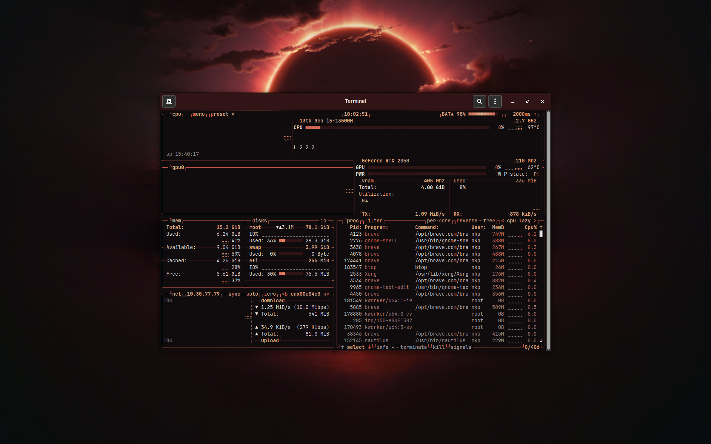
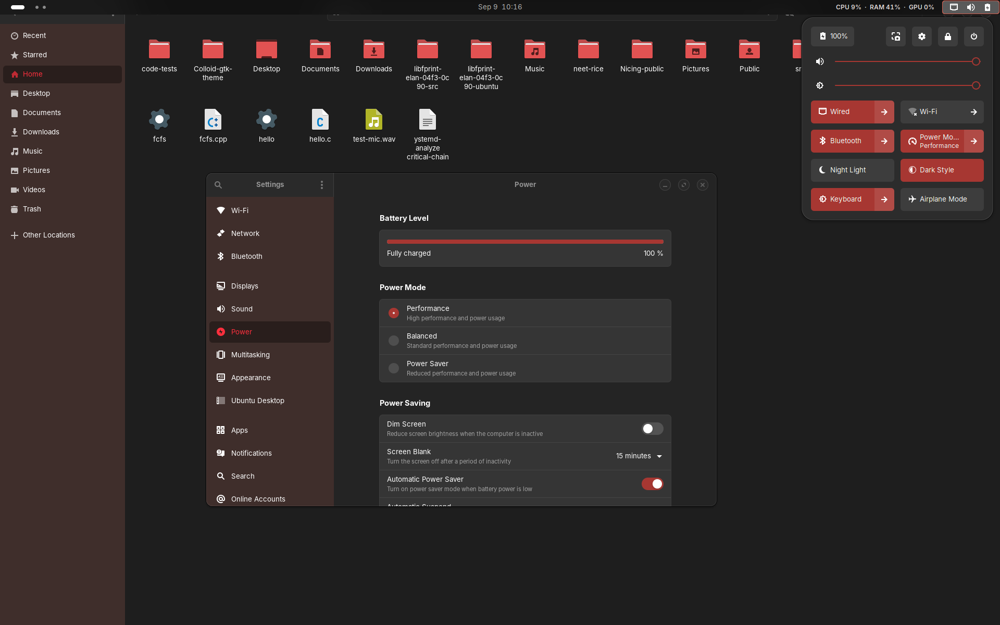
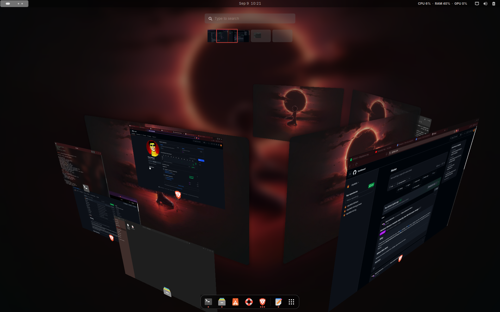
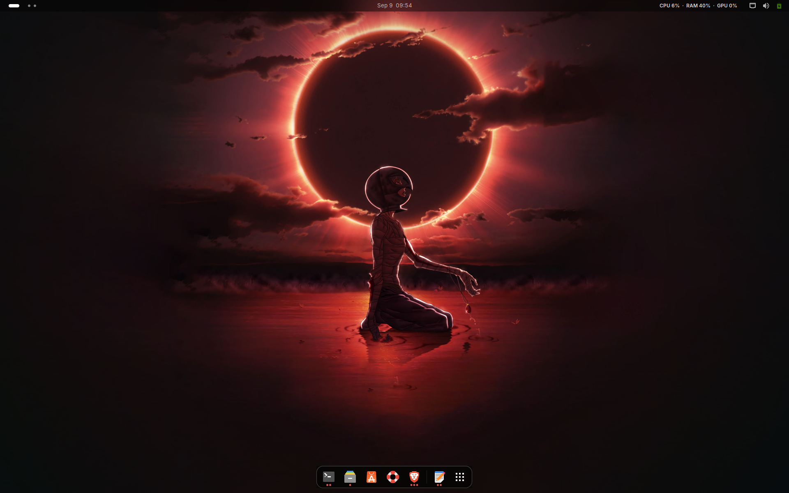

# Nicing

> I named it like "Neet's Ricing", yeah didn't give a long thought for naming it.

Nicing is my personal GNOME rice for Ubuntu.

I built this because at some point I got tired of the default Ubuntu desktop looking... well, default. And to look cool in front of people around me peeking on my laptop.

So I started messing with GTK, GNOME Shell, Fastfetch, btop, terminal colors, icons, wallpapers, extensions, random CSS bullshit, and eventually it turned into an actual setup, in the meantime, I fucked it up dozens of times, so then I started to use git.

---

## what it looks like

The whole thing is built around a dark / crimson aesthetic:

- dark GTK surfaces
- crimson accents
- custom GNOME Shell styling
- crimson Nautilus sidebar
- custom red image icons
- custom terminal colors
- Fastfetch setup
- btop theme
- custom shell prompt
- CPU usage display
- Neet Metrics
- Blur My Shell / dock / top-bar configuration
- Griffith wallpaper

The general idea is:

**dark everything + red accents**

---

## the wallpaper


The main wallpaper is based around **Griffith during the Eclipse**.

If you've seen Berserk, you know exactly why that fits the whole thing.

The Eclipse imagery — it all ended up matching the aesthetic of the rice way too well. so yeah.

---

## screenshots

### the desktop


### terminal


### system monitoring



### files



### workspace switching



### another desktop view



---

## requirements

This is made for **Ubuntu + GNOME**.

The setup expects these basic GNOME components to exist:

- `gsettings`
- `gnome-extensions`
- `gnome-terminal`
- `systemctl`

You'll also want the normal tools used by the configuration, such as:

- Fastfetch
- btop
- GNOME Extensions
- a working systemd user session

The installer checks the basic GNOME dependencies before doing anything.

---

## installation

Clone the repo:

```bash
git clone https://github.com/nkp4806/Nicing.git
cd Nicing
```
Then run:

```bash
chmod +x install.sh
./install.sh
```

That's it.

The installer copies the configuration into the appropriate locations and applies the theme automatically.

You may need to open a new terminal and/or log out and back in for some GNOME changes to fully show up.

---

## what the installer actually does

The installer isn't just copying one GTK file but it sets up the following

### theme

-   My Crimson theme configuration, I just named it "Neet Crimson" 
-   GTK 3 styling
-   GTK 4 styling
-   GNOME Shell theme
-   interface settings
-   terminal theme
-   Blur My Shell configuration
-   dock configuration
-   top-bar configuration

### terminal / shell

-   custom Bash prompt
-   Fastfetch configuration
-   My ASCII (Beherit)
-   useful Git aliases
-   theme switcher

### system stats

-   custom Fastfetch resource bars
-   CPU sampler
-   CPU display
-   My Metrics GNOME extension, ofc I named it "Neet Metrics" 
-   btop configuration + theme

### icons

Nicing includes a small Neet-Papirus icon theme override.

It inherits from Papirus-Dark instead of replacing the entire icon theme.

That means we only override the icons we actually want to change.

For example, image file icons are changed from the usual cyan Papirus style to the crimson accent.

### wallpaper

The Griffith wallpaper is installed into:

```text
~/Pictures/Wallpapers/
```

---

## the `.bashrc` thing

*important*

The installer does **NOT** overwrite your existing `~/.bashrc`.

I don't want a rice installer nuking someone's shell configuration just because they wanted a pretty terminal.

Instead, Nicing checks whether its Bash integration is already present.

If it isn't, it adds a clearly marked block:

```bash
# >>> NEET RICE >>>
...
# <<< NEET RICE <<<
```

So your existing `.bashrc` stays intact.

If Nicing is already installed, the installer detects the existing integration and doesn't add it again.

---

## theme switching

Nicing comes with a small theme switcher:

```bash
neet-theme crimson
```

The idea is that the theme configuration isn't scattered randomly across your home directory.

The theme lives in:

```text
~/.config/neet-themes/
```

and `neet-theme` *(yeah)* applies the configuration across the different parts of the desktop.

---

## project structure

```text
Nicing/
├── config/
│   ├── bashrc
│   ├── btop/
│   ├── fastfetch/
│   ├── gtk-3.0/
│   ├── gtk-4.0/
│   ├── icons/
│   ├── neet-themes/
│   └── systemd/
│
├── extensions/
│   └── neet-metrics@local/
│
├── gnome-shell/
│   └── gnome-shell.css
│
├── local-bin/
│   ├── neet-cpu-display.sh
│   ├── neet-cpu-sampler.sh
│   ├── neet-metrics.sh
│   └── neet-theme
│
├── wallpaper/
│   └── griffith-crimson.bmp
│
└── install.sh
```

---

## a few things to know

This is a personal rice, not a universal Ubuntu configuration.

It was built around my own GNOME setup, so some things may look slightly different depending on:

-   Ubuntu version
-   GNOME version
-   GTK version
-   installed extensions
-   display/session configuration

In particular, GTK themes can throw warnings when upstream theme CSS uses syntax that a particular GTK version doesn't like.

That doesn't necessarily mean Nicing itself is broken.

Also, some GNOME Shell changes may require a logout/login or shell restart.

---

## configuration locations

The installer is intentionally simple and predictable.

Most Nicing configuration is stored in the repo and copied to standard locations under:

```text
~/.config/
~/.local/
~/.themes/
~/.icons/
```

If you're experimenting with the rice, keep the repository around.

The repo is the source of truth for the Nicing configuration.

---

## why I made this

For the love of the game.

TBH I just wanted my Linux desktop to feel like **mine**.

Ubuntu works perfectly fine out of the box, but I don't really enjoy leaving things at the default when I know I can change them. 

So I kept changing shit.
Then I broke things.
Then I fixed them.
Then I broke them again.
Then I made scripts so I wouldn't have to manually fix them every time.

Ricing is a **Great** experience to have, so I'd suggest you should try it yourself once, you can add up things in my customization too if you want.
 
---

## credits

Nicing uses / builds on top of existing Linux projects and themes, including things from the GNOME and Papirus ecosystems.

Please check the respective project licenses before redistributing modified assets.

The Griffith imagery is included as part of my personal aesthetic setup and is not intended to claim ownership of the original artwork or characters.

---

## license

This repository contains a mixture of original configuration/scripts and modified or derived theme assets.

See the individual files and upstream projects for their respective licensing terms.

And for my original configuration/scripts: **do whatever the fuck you want**

---


